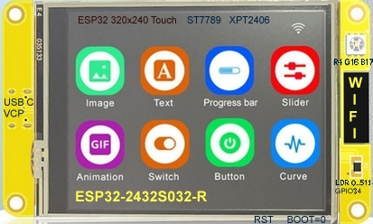

# ESP32-2432S032R
 
Programms for ESP32 Development Kit with TouchScreen(ST7789,XPT2406) 240x320 Pixel 3.2 Inch
<ul>
  <li>ST7789 Display 240x320</li>
  <li>XPT2046 for Resitive Touch
  <li>RGB LED pin 4,16,17</li>
  <li>LDR on pin 34 Analog Input for Auto Adjust Display-Brightness</li>
  <li>LVGL Support </li>
  <li>Powered by USB C</li>
  <li>I2C-Interface on JST/SH 1.25mm [3V3 SDA/21 SCL/22 GND]</li>
  <li>Interface for Akku with LoadControll</li>
</ul>
